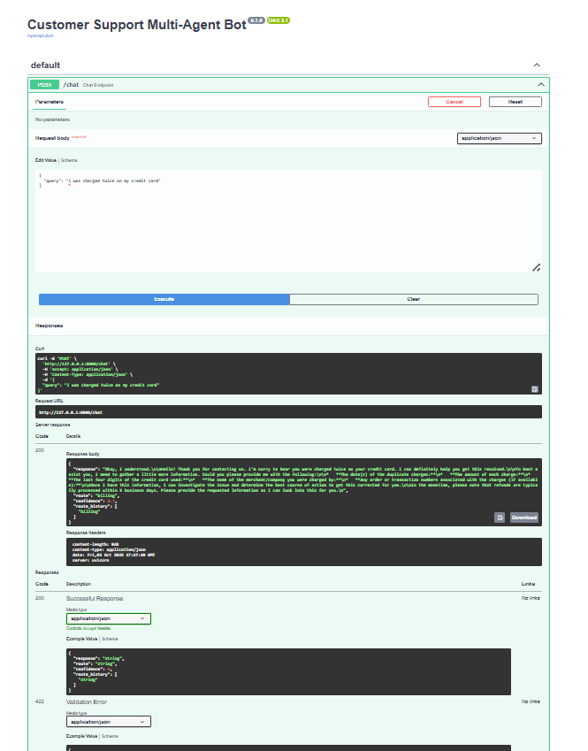
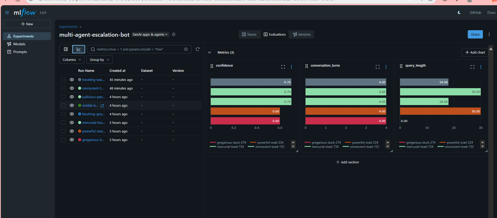
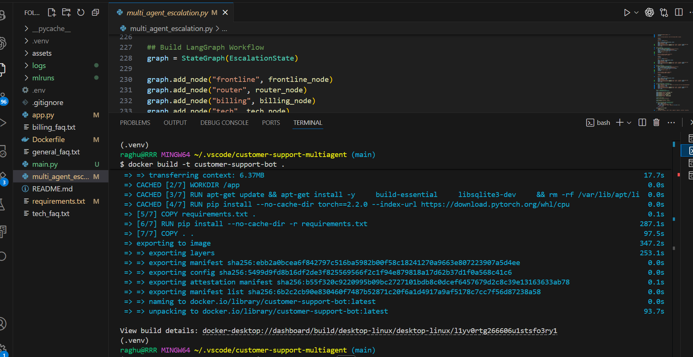

#  Customer Support Multi-Agent Assistant

A production-style **customer support AI assistant** that uses **multiple specialized agents** to solve user problems.  
Instead of a single chatbot trying to answer everything, this system **routes each query to the right expert** — billing, technical support, or general inquiries.  

It’s powered by **LangGraph + Gemini**, enhanced with **RAG knowledge bases**, and deployed as a **FastAPI microservice** running inside **Docker**.  
For monitoring and real-world readiness, it’s integrated with **MLflow** and structured logging.

---

## 🌟 Highlights

- **Agent Collaboration**
  - Frontline agent greets and triages
  - Router agent decides where to send the query
  - Specialists (billing, tech, general) answer using department-specific knowledge

- **Escalation & Clarify**
  - Low-confidence routing falls back to clarification
  - Short-term memory keeps context across clarifications
  - Handoff summaries ensure smooth agent-to-agent transitions

- **Knowledge Integration (RAG)**
  - Each department uses its own FAQ knowledge base
  - Built with HuggingFace embeddings (`all-MiniLM-L6-v2`) + ChromaDB

- **Deployment Ready**
  - REST API via FastAPI
  - Swagger UI available at `/docs`
  - Dockerized for portability across environments

- **Observability**
  - JSONL logs for every query/response
  - MLflow tracking (confidence scores, route history, artifacts)

---

##  Tech Stack

- **LLM**: Google Gemini (`gemini-2.0-flash-001`)
- **Orchestration**: LangGraph + LangChain
- **Embeddings**: HuggingFace Sentence Transformers
- **Vector DB**: Chroma
- **API Layer**: FastAPI + Uvicorn
- **Deployment**: Docker
- **Monitoring**: MLflow

---

##  Quick Start

### 1. Clone & Setup
```bash
git clone https://github.com/<your-username>/customer-support-bot.git
cd customer-support-bot
```
### 2.Environment
Create a `.env` file with:
```bash
GOOGLE_API_KEY=your_api_key_here
```
### 3. Run Locally
```bash
pip install -r requirements.txt
python main.py
```
→ Visit http://127.0.0.1:8000/docs

### 4. Run with Docker
```bash
docker build -t customer-support-bot .
docker run -p 8000:8000 --env-file .env customer-support-bot
```

---

##  Example Queries
```bash
--Billing: “I was charged twice on my card”

--Technical: “The app keeps freezing when I log in”

--General: “How can I reset my password?”

Each query is routed to the correct specialist agent with confidence scoring.
```

## Monitoring with MLflow
```bash
`mlflow ui`
→ Open http://127.0.0.1:5000-- to track metrics, routes, and saved conversations.
```

## Project Layout
```bash
customer-support-multiagent/
│── main.py                  
│── multi_agent_escalation.py 
│── billing_faq.txt
│── tech_faq.txt
│── general_faq.txt
│── requirements.txt
│── Dockerfile
│── logs/
│    └── session_log.jsonl
```

## Screenshots

### FastAPI Swagger UI
This shows the `/chat` endpoint in action.


### MLflow Dashboard
Tracking confidence scores, routes, and conversation metrics.


### Docker Container Running the Service
Proof of successful Docker deployment and API running on port 8000.



## Why This Project Matters

Customer support is one of the most common enterprise use-cases for Generative AI.
This project demonstrates how to go beyond a single chatbot and build a system that feels closer to how real support teams operate — with specialized experts, routing, and observability

## Author
```bash
Raghuramreddy Thirumalareddy
```
**Github** -- https://github.com/RaghuramReddy9
**Linkdin** -- https://www.linkedin.com/in/raghuramreddy-ai


