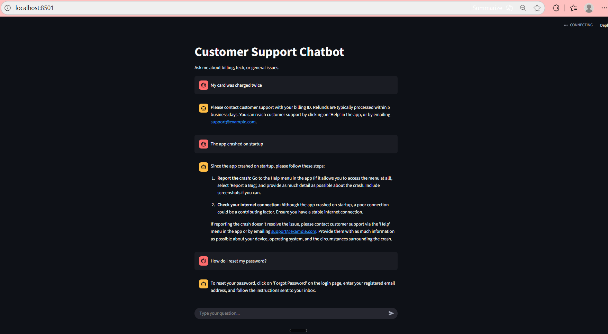

#  Customer Support Multi-Agent Chatbot

A **multi-agent customer support assistant** built with **LangGraph, Gemini (Google GenAI), and Streamlit**.  
The bot automatically **routes queries** to the correct specialist (Billing, Tech, or General FAQ) and provides answers grounded in real support documents using **RAG (Retrieval-Augmented Generation)**.

---

<details>

<summary> Features </summary>

-  **AI Router Agent** – classifies user queries into *Billing*, *Tech Support*, or *General*.
-  **RAG Specialists** – each department uses its own FAQ knowledge base:
  - Billing → `billing_faq.txt`
  - Tech Support → `tech_faq.txt`
  - General FAQ → `general_faq.txt`
-  **LangGraph Workflow** – orchestrates the multi-agent escalation pipeline.
-  **Streamlit UI** – clean, chat-based interface with history.
-  **Environment Config** – secrets managed via `.env`.

</details>

---

<details>

<summary> Architecture </summary>

• User → Frontline Agent → Router Agent (Gemini) → Specialist Agent (Billing / Tech / General) → Response

- **Frontline Agent** – greets users.  
- **Router Agent** – powered by Gemini, decides which specialist to escalate to.  
- **Specialist Agents** – provide grounded responses using **RAG** over department-specific FAQs.  
- **Streamlit** – delivers a conversational interface.  

</details>

---

<details>

<summary> Getting Started </summary>

### 1. Clone the Repo
```bash
git clone https://github.com/RaghuramReddy9/customer-support-multiagent.git
cd customer-support-multiagent
```
### 2. Create a Virtual Environment
```bash
python -m venv .venv
source .venv/bin/activate   # Mac/Linux
.venv\Scripts\activate      # Windows
```
### 3. Install Dependencies
```bash
pip install -r requirements.txt
```
### 4. Add API Key
Create a .env file in the project root:
```bash
GOOGLE_API_KEY=your_gemini_api_key_here
```
### 5. Run the App
```bash
streamlit run app.py
```
App will be available at → http://localhost:8501

</details>

---

<details>

<summary> Project Structure </summary>

customer-support-multiagent/
│── app.py                    # Streamlit UI
│── multi_agent_escalation.py # LangGraph multi-agent workflow
│── billing_faq.txt           # Billing knowledge base
│── tech_faq.txt              # Tech support knowledge base
│── general_faq.txt           # General FAQ knowledge base
│── requirements.txt          # Dependencies
│── Dockerfile                # For containerization
│── assets/                   # Screenshots (used in README)
│── README.md                 # Project overview
│── .env                      # API keys (not committed)
│── .gitignore                # Ignore venv, cache, .env, etc.

</details>

---

<details>

<summary> Screenshots </summary>



</details>

---

<details>

<summary> Future Enhancements </summary>

• Add Agent-to-Agent collaboration (specialists ask clarifying questions).

• Deploy to Hugging Face Spaces / AWS with Docker.

• Extend knowledge bases with real company docs.

• Add analytics dashboard for routed queries (Billing vs Tech vs General).

</details>

---

<details>

<summary> Tech Stack </summary>

• LLM: Gemini 1.5 Flash (Google GenAI)

• Framework: LangGraph + LangChain

• Vector DB: Chroma + HuggingFace Embeddings

• Frontend: Streamlit

• Deployment: Docker-ready

</details>

---

<details>

<summary> Author </summary>
👤 Raghuramreddy Thirumalareddy

• GitHub--> https://github.com/RaghuramReddy9

• LinkedIn--> https://www.linkedin.com/in/raghuramreddy-ai

</details>


